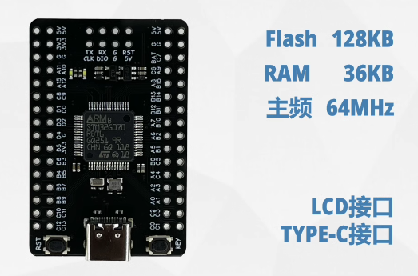

# STM32G070RBT6_Demo

> 历程芯片型号： STM32G070RBT6
>
> 开发工具：STM32CubeMX V6.10.0   Keil：MDK-ARM V5.32
>
> 原理图见：[STM32G070RBT6_Sch.pdf](attachments/STM32G070RBT6_Sch.pdf)

## List

### 01.GPIO

Description：LED闪烁

### 02.USART_EXIT

Description：外部中断按键，控制led翻转

### 03.USART

Description：实现基本串口功能，重定向printf， 中断接收（单字节判断，多字节特定结束符判断）

### 04.USART_DMA

Description：使用DMA对接收发送进行改造，减少CPU占用

### 05.USART_IDLE_DMA

Description：基于串口空闲中断+DMA实现真正的串口不定长接收

### 06.ADC

Description：ADC单通道轮询

### 07.ADC_DMA

Description：ADC+DMA 多通道采集

## Reference

1. https://item.taobao.com/item.htm?id=658090998525&spm=a1z10.1-c.w4004-23946790114.4.772f636a5pD4Ya&sku_properties=1627207:14198304
1. https://duruofu.github.io/2024/02/12/4.%E7%A1%AC%E4%BB%B6%E7%9B%B8%E5%85%B3/MCU/STM32/STM32CubeMX%E9%A1%B9%E7%9B%AE%E6%A0%87%E5%87%86%E5%8C%96/
1. https://www.bilibili.com/video/BV1kL411Y7Uf/?p=23&spm_id_from=333.1007.top_right_bar_window_history.content.click
1. https://www.bilibili.com/video/BV1do4y1F7wt/?spm_id_from=333.1007.top_right_bar_window_history.content.click&vd_source=ef5a0ab0106372751602034cdd9ab98e

